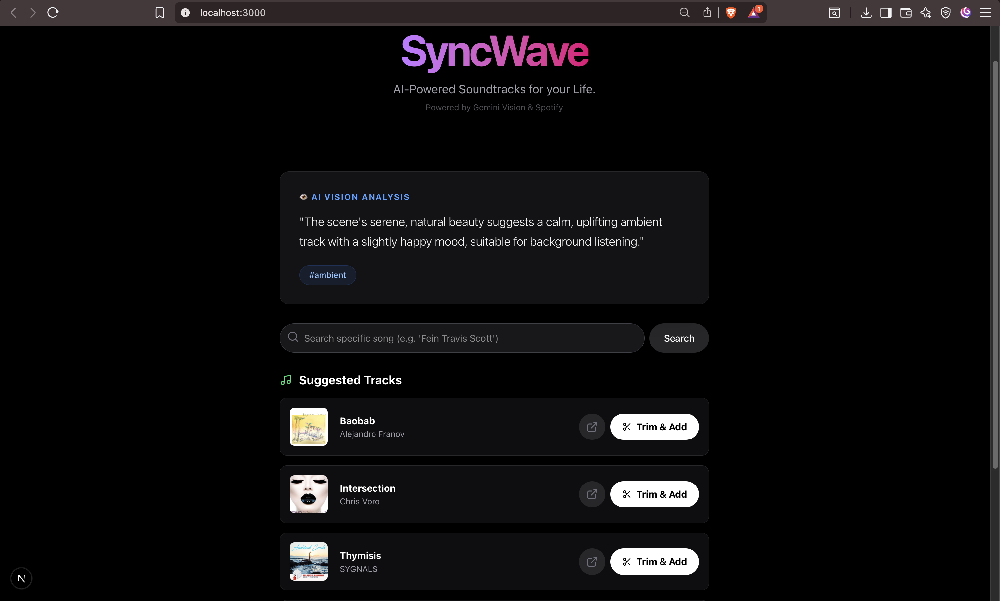

<div align="center">

# 🌊 SyncWave

### Automated Multimodal Video-to-Audio Synchronization Pipeline


<a href="(https://drive.google.com/file/d/1gT_UIeW19nnnR2wGeJS9CrsMJt6O5Qrw/view?usp=sharing)">
  
</a>

<br />

**SyncWave** is a full-stack engine designed to automate audio curation for video content. By leveraging **Computer Vision** and **Large Language Models**, the system extracts semantic context from raw video inputs and maps them to mathematically relevant audio tracks via the Spotify API.

</div>

---

## ⚡ Core Architecture

* **👁️ Semantic Video Analysis:** Utilizes **Google Gemini 1.5 Flash** to perform frame-by-frame visual reasoning, converting unstructured video data into structured metadata (genre seeds, tempo, mood).
* **🎵 Context-Aware Retrieval:** Maps visual metadata to Spotify's audio feature endpoints to retrieve tracks with matching energy, valence, and danceability.
* **⚙️ Server-Side Processing:** A dedicated **FastAPI** backend orchestrates **FFmpeg** processes to handle stream concatenation and audio normalization without client-side resource strain.
* **⏱️ Precision Alignment:** Custom interface allowing millisecond-precision timestamp selection for exact audio-visual synchronization.

---

## 🛠️ Tech Stack

| Component | Technology |
| :--- | :--- |
| **Frontend** | Next.js 14 (App Router), Tailwind CSS, Framer Motion |
| **Backend** | Python 3.9+, FastAPI, Uvicorn |
| **AI Model** | Google Gemini 1.5 Flash (Generative AI SDK) |
| **Data Source** | Spotipy (Spotify Web API) |
| **Media Engine** | FFmpeg, Docker |

---

## 🚀 Installation & Setup

### 1. Clone Repository
```bash
git clone [https://github.com/Devarshp0511/SyncWave.git](https://github.com/Devarshp0511/SyncWave.git)
cd SyncWave
```
### 2. Backend Configuration
Navigate to the backend directory to set up the Python environment.

```bash
cd backend
python -m venv venv

# Activate Virtual Environment
# Windows: venv\Scripts\activate
# Mac/Linux: source venv/bin/activate

pip install -r requirements.txt
```
Environment Variables: Create a .env file in the backend/ root directory:
```Code snippet
GOOGLE_API_KEY=your_gemini_key
SPOTIPY_CLIENT_ID=your_spotify_id
SPOTIPY_CLIENT_SECRET=your_spotify_secret
```
Start Server:
```bash
uvicorn main:app --reload
```
### 3. Frontend Configuration
Open a new terminal and navigate to the frontend directory.

```bash
cd ../frontend
npm install
```
Environment Variables: Create a .env.local file in the frontend/ root directory:
```Code snippet
NEXT_PUBLIC_BACKEND_URL=http://localhost:8000
```
Start Client:
```bash
npm run dev
```
Client runs at http://localhost:3000

